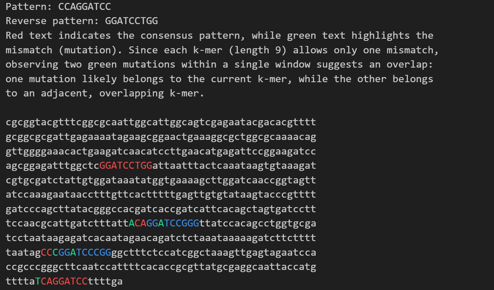

# Salmonella Origin Finder

This tool finds the replication origin (oriC) in *Salmonella enterica* using **GC Skew Analysis** and **Pattern Matching**.

## 1. Finding the Region (GC Skew)
I calculate the GC skew across the genome. The minimum point (lowest dip) is the candidate region for the origin.

## 2. Finding the Signal (Pattern Match)
Inside that region, the script scans for DnaA boxes (e.g., `CCAGGATCC`) allowing for mismatches.

* **Red:** Underlying pattern.
* **Blue:** Overlapping pattern.
* **Green:** Mismatch (mutation).

